# A. API BUSINESS CUSTOMER V1

### A.1.1 Registra un cliente

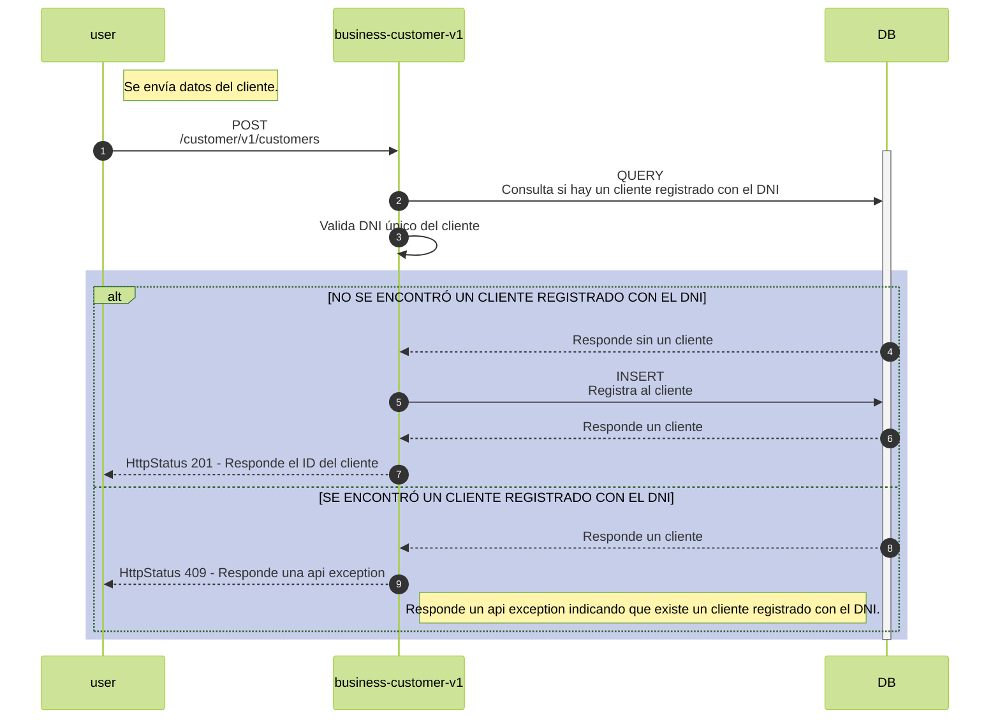

### A.1.2 Obtiene clientes

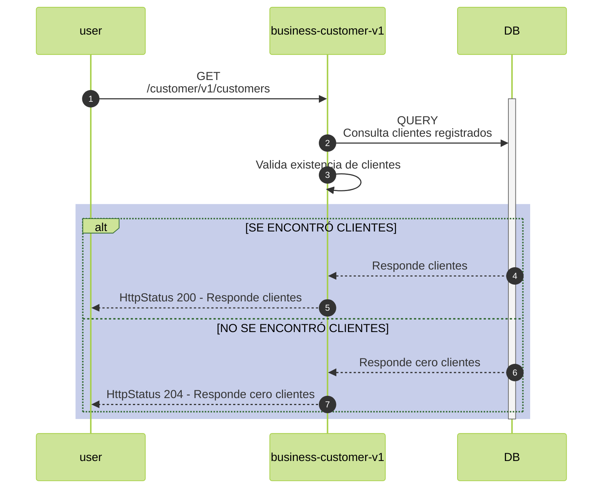

### A.1.3 Obtiene un cliente por ID

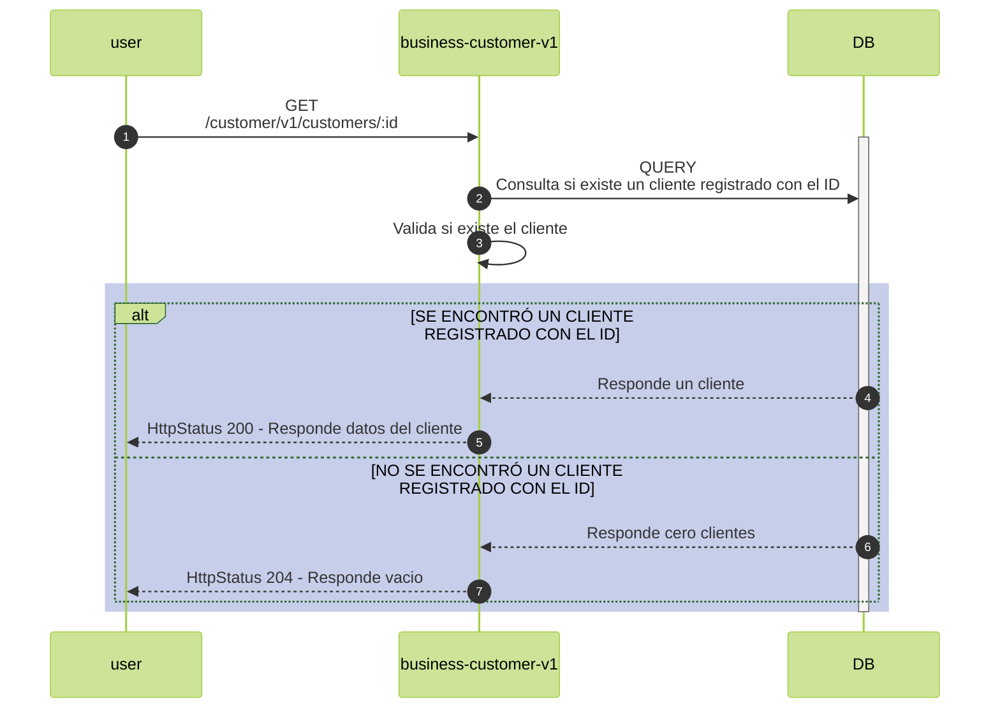

### A.1.4 Actualiza un cliente

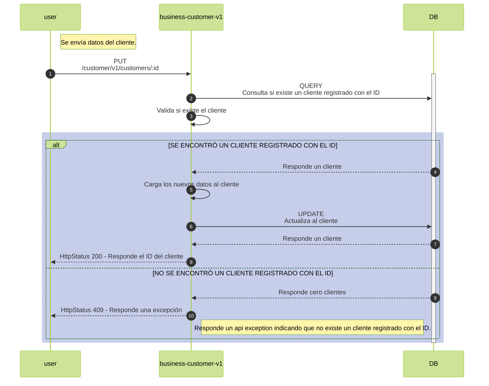

### A.1.5 Elimina un cliente

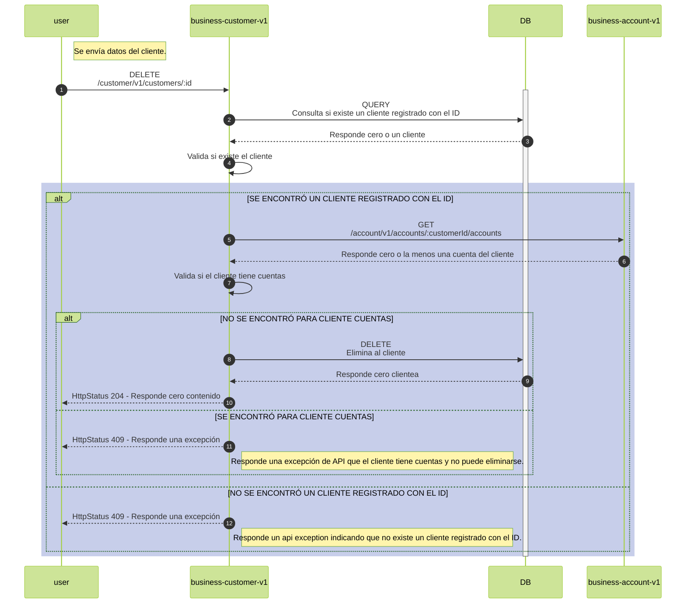

# B. API BUSINESS ACCOUNT V1

### B.1.1 Registra una cuenta

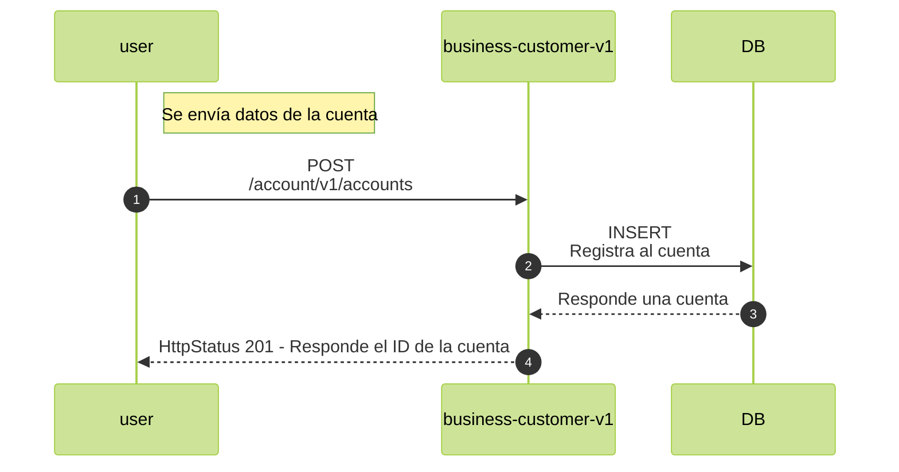

### B.1.1 Obtener cuentas

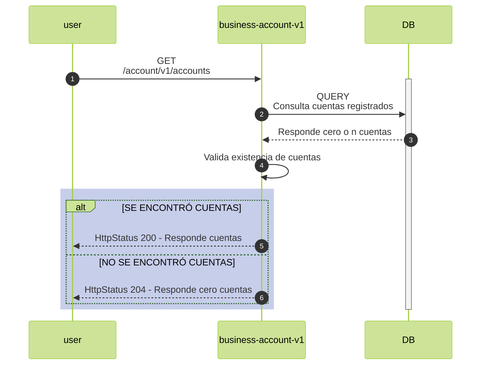

### B.1.3 Obtiene una cuenta por ID

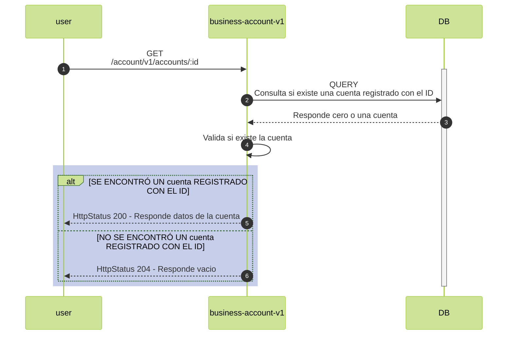

### B.1.4 Realizar un depósito en una cuenta bancaria 

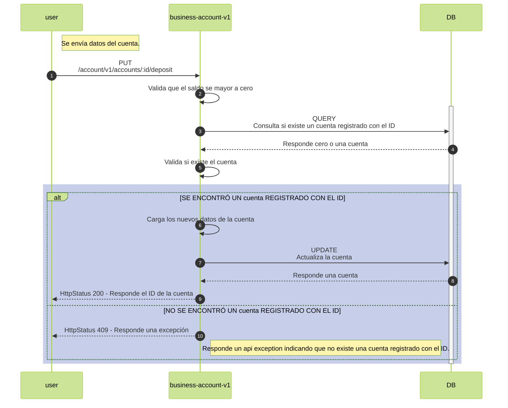

### B.1.4 Realizar un retiro de una cuenta bancaria 

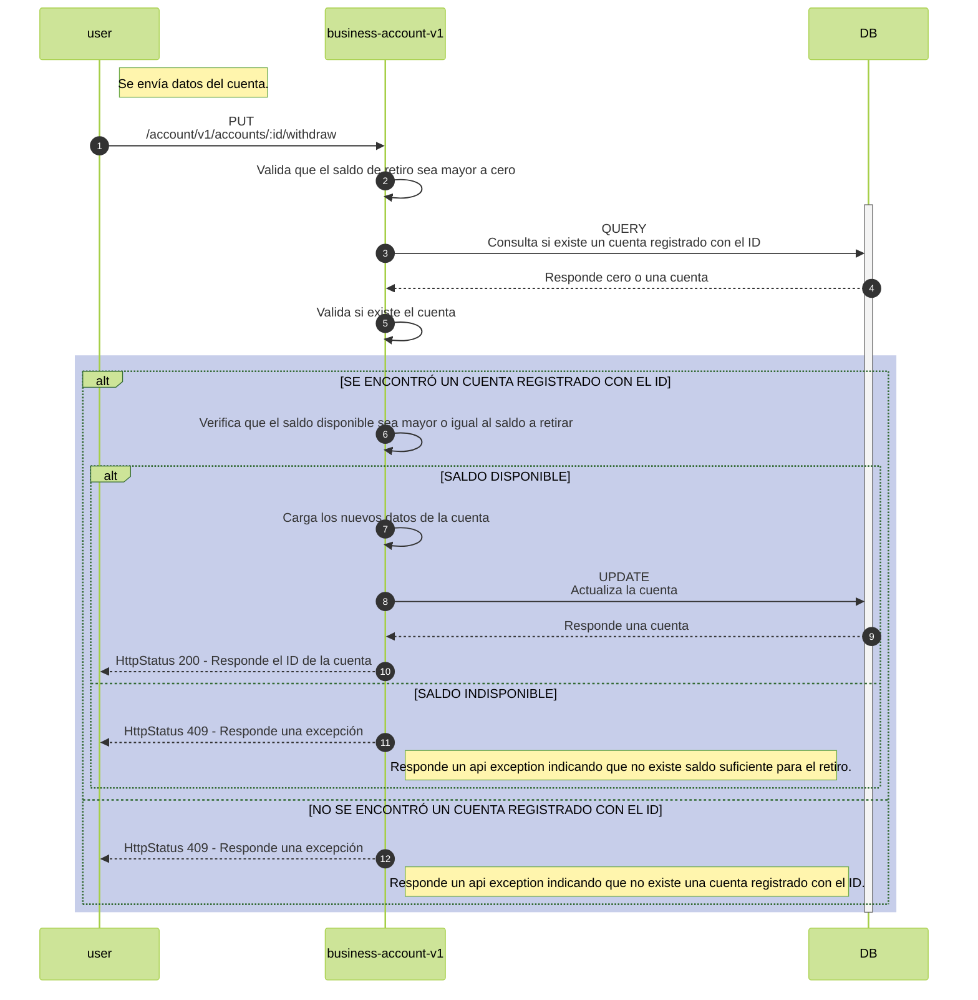

### B.1.5 Elimina un cuenta

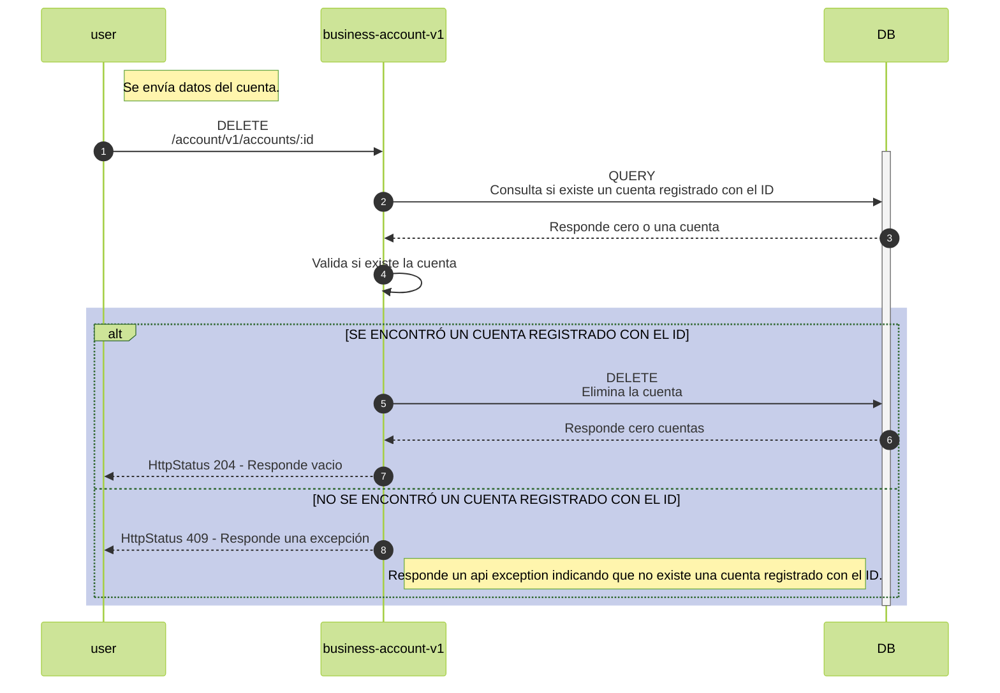